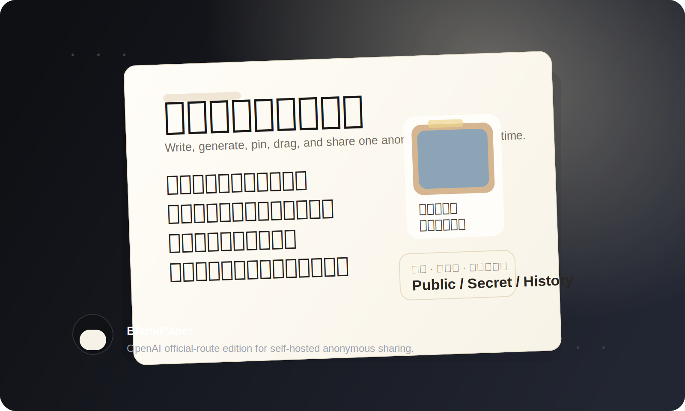
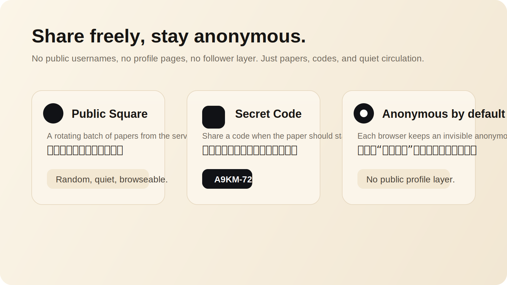
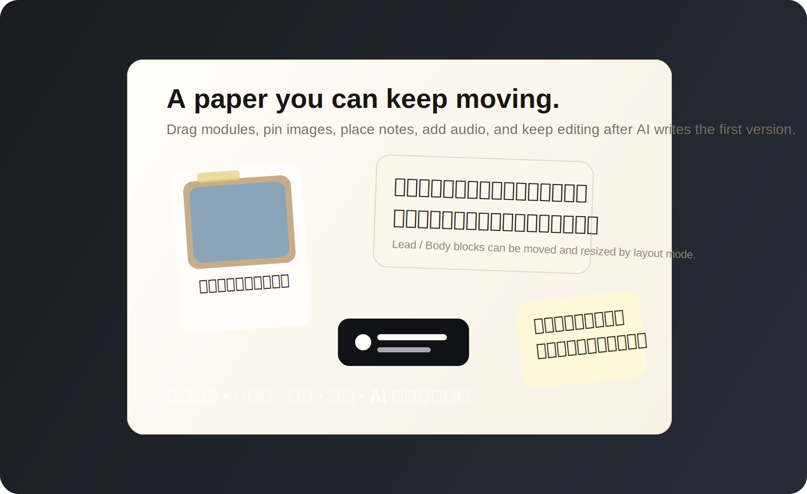

<p align="center">
  
</p>

<h1 align="center">BlankPaper</h1>
<p align="center">
  A paper-first, anonymous, freely shareable storytelling surface.<br />
  把碎片写成一张纸，而不是一份文档。
</p>

<p align="center">
  
</p>

## What It Is

`BlankPaper` is not trying to be another docs app, notes app, or slide tool.

It is a web surface for turning:

- a sentence
- a few images
- a voice note
- a half-finished memory

into a single editable paper that feels written, pinned, moved, and left behind on purpose.

`BlankPaper` 不是“更好看的笔记软件”。

它更像是一张数字白纸：

- 你可以手写
- 可以先让 AI 起稿
- 可以贴图、贴录音、贴批注
- 可以继续拖动、修改、再分享

重点不是“生成一篇内容”，而是把一件事留在一张纸上。

## Why This OpenAI Edition Exists

This directory keeps the same front-end experience as the main deployment edition, but switches the AI route to the official OpenAI server-side API.

That means:

- your API key stays on the server
- the browser never sees the secret
- uploaded images are sent to your local `/api/generate` route first
- you can self-host the whole product and keep control of storage

## A Product About Anonymous Sharing

<p align="center">
  
</p>

`BlankPaper` is designed around the idea that a paper can circulate without turning into a social profile.

There are no public usernames, no follower graph, and no profile page as the center of the product.

Instead, the product revolves around the paper itself:

- `Public Square`: a rotating batch of publicly shared papers
- `Secret Code`: share a code when a paper should stay semi-private
- `History`: each browser keeps an invisible anonymous identity so “my papers” still works

匿名不是“完全没有归属”，而是：

- 不展示用户名
- 不做公开主页
- 不把人变成产品主角
- 只让纸本身流动起来

## Free Layout, Not Fixed Cards

<p align="center">
  
</p>

AI can draft a first version, but the paper is still yours.

You can keep editing:

- handwritten title, lead, body, observations, closing
- movable paper modules
- pinned images
- audio clips on paper
- sticky notes and side annotations
- background effects and layout modes

这不是“AI 一次性生成然后你只能看”。

而是：

- AI 先帮你铺开一版
- 你继续改字、改图、改布局
- 最后留下的是你的纸，不是模型的模板

## Feature Highlights

- OpenAI official server route with no client-side key exposure
- text + up to 4 images sent into generation together
- editable, draggable paper layout after generation
- public square, secret-code access, and personal history
- anonymous-by-default sharing model
- server-side paper persistence for self-hosted deployment
- image, audio, note, and handwritten-style paper composition
- Chinese and English interface support

## How Storage Works

By default, papers are stored on the server in:

```text
data/papers.json
```

This is enough for a simple self-hosted deployment on a VPS or any server with persistent disk.

Important:

- public square content comes from the server store
- secret-code search also reads from the server store
- history uses an anonymous browser identity plus server-side records
- local storage is kept only as a client cache and draft fallback

If you plan to deploy at larger scale or on ephemeral/serverless infrastructure, replace `data/papers.json` with a real database.

## Quick Start

```bash
cd /Users/sunyuefeng/Documents/trae_projects/whitepaper/whitepaper-web-openai/BlankPaper
npm install
cp .env.example .env.local
npm run dev
```

Open:

```text
http://localhost:3000
```

## Environment Variables

Set these on the server side:

- `OPENAI_API_KEY`
- `OPENAI_MODEL` default: `gpt-4.1-mini`
- `OPENAI_API_URL` optional, default: `https://api.openai.com/v1/responses`
- `OPENAI_REASONING_EFFORT` optional

Example:

```bash
OPENAI_API_KEY=your_key_here
OPENAI_MODEL=gpt-4.1-mini
# OPENAI_API_URL=https://api.openai.com/v1/responses
# OPENAI_REASONING_EFFORT=medium
```

## What The Browser Sends

The client only sends:

- title
- text prompt
- up to 4 image data URLs
- locale

All OpenAI requests happen inside the server route:

- [src/app/api/generate/route.ts](./src/app/api/generate/route.ts)

Paper persistence lives here:

- [src/app/api/papers/route.ts](./src/app/api/papers/route.ts)

## Recommended Use Cases

- anonymous testimony pages
- emotional or personal event records
- visual diary entries
- scene-based storytelling
- memory fragments that need both text and image context
- small-scale private/public community sharing

## For Open Source / Self-Hosted Users

This edition is meant to be easy to read, easy to deploy, and easy to modify.

If you want to:

- swap the model
- replace file storage with PostgreSQL / Supabase / SQLite
- add moderation or admin deletion
- change the anonymous sharing rules
- adapt the UI to your own community

this is the version to fork.

## License

This directory follows the repository-level `GNU Affero General Public License v3.0`.

- derivatives deployed over a network must disclose source
- commercial use is allowed under AGPL terms
- the license remains standard copyleft open source

See:

- [../LICENSE](../LICENSE)

## Support

If this project is useful to you, you can support continued work here:

- [Support on Ko-fi](https://ko-fi.com/O5O01KTRSP)

